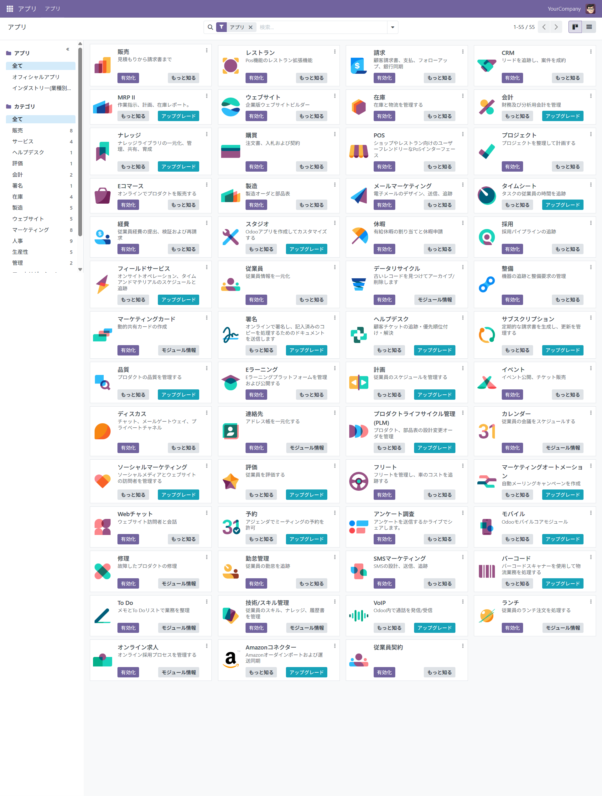

# 🇯🇵 Odoo 日本語対応 Docker 環境（基盤システム向け）

このリポジトリは、**企業の基盤システム（ERP）向けのオープンソース「Odoo」の日本語対応Docker環境**を提供しています。
ローカル環境において、**簡単に日本語対応のOdooを立ち上げることが可能**です。

Odoo（旧OpenERP）は販売（CRMを含む）機能に加えて、**会計、在庫管理、製造、人事、eコマース**など、企業の基幹業務を支える多様な機能を備えており、
この環境を活用することで、**基盤システム全般に関する理解とスキルの習得**が可能です。

## ✅ 特長（特徴）

* 日本語ローカライズされた Odoo 環境 
* Docker を用いた簡易セットアップ 
* 各種Odooモジュールを通じて、**基幹業務の実務理解を支援**
* **新人・営業向けの業務研修ツール**としても活用可能

## 🧩 対応機能（Odooが提供する基幹業務）

* ✅ **販売管理**
* ✅ **会計管理**
* ✅ **在庫管理**
* ✅ **製造管理**
* ✅ **人事管理**
* ✅ **営業支援**
* ✅ **顧客管理（CRM含む）**
* ✅ **勤怠管理**
* ✅ **eコマース機能** など



## 🎓 教育・研修への活用

この環境は、**新入社員や営業担当者向けの業務研修用教材**として特に効果的です。
Odoo上で業務フローを実際に操作しながら学習できるため、**実践的かつ体験型の教育が可能**です。

## 📦 構成ファイル

```
odoo-jp-docker
├─ docker-compose.yml                  ← Docker配置ファイル
├─ all_menu.png                        ← 全メニュー画像ファイル
├─ LICENSE                             ← ライセンス
└─ README                              ← 説明
```

## 📙 使用方法

### 1. 前提

- [Docker Desktop](https://www.docker.com/products/docker-desktop/) がインストールされていること

### 2. 日本語版Dockerの Odoo 導入と初回起動（Windows環境例）

* 1. コマンドプロンプト（cmd）を起動

* 2. 以下のコマンドを順に実行
```
mkdir odoo-jp
cd odoo-jp
curl -O https://raw.githubusercontent.com/8alfalfa8/odoo-jp-docker/refs/heads/main/docker-compose.yml
docker pull 8alfalfa8/postgres:latest
docker pull 8alfalfa8/odoo:latest
docker-compose up -d
```

### 3. 初回起動以降の操作
```
docker ps                      # コンテナ一覧の確認
docker start <コンテナ名>       # コンテナの起動
docker stop <コンテナ名>        # コンテナの停止
docker restart <コンテナ名>     # コンテナの再起動
```

### 4. **odoo**の使用
ブラウザで以下にアクセス：
```
http://localhost:8069/
```
初回アクセス時、下記情報を入力してください：
| 項目              | 値                 |
| --------------- | ----------------- |
| Master Password | `admin`（必須固定値）       |
| Database Name   | `odoo`（任意値）        |
| Email           | `aaa@bbb.com`（任意値、ログインIDのため、メモを取ってください） |
| Password        | `odoo`（任意値、ログインPWのため、メモを取ってください）        |
| Phone Number    | `00000000`（任意値）    |
| Language        | `Japanese / 日本語`  |
| Country         | `Japan`           |
| Demo Data       | ✅ チェックを入れる        |

「Create Database」ボタンを押下して完了です。


### 5. ログイン画面
上記4.で登録した Email と Password を入力してログインしてください。


### 6. ログイン後のユーザドキュメントなどについて
下記をご参照ください。
* https://www.odoo.com/documentation/18.0/ja/index.html


## ⚠️ 自己責任に関する注意事項（Self Responsibility Disclaimer）

本ツール（odoo-jp-docker）は、ユーザーの利便性向上を目的として無償で提供されていますが、**ご利用に際してはすべて自己責任でお願いいたします。**

## 🤝 商談歓迎

ご利用や、機能開発、環境構築のご支援をご希望の方は、下記までご連絡ください。
```
Colorful株式会社

〒151-0051
東京都渋谷区千駄ヶ谷3-51-10
PORTAL POINT HARAJUKU 607
info@colorful-inc.jp
```
https://colorful-inc.jp/


## 📝 ライセンス

本リポジトリは [Apache ライセンス](./LICENSE) のもとで公開されています。

